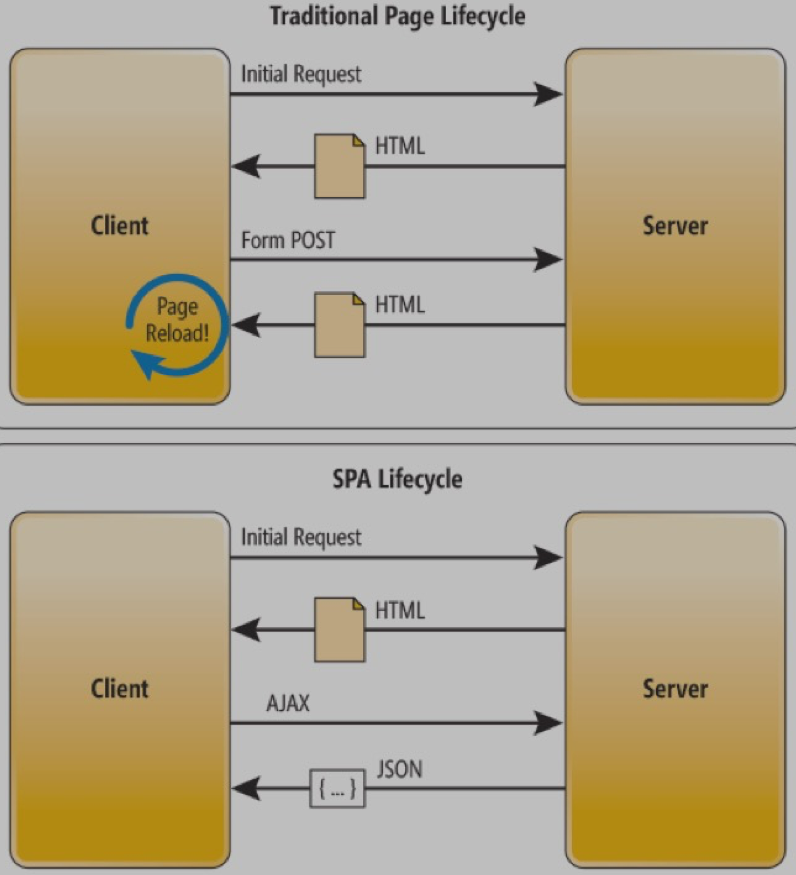

# დიზაინ პატერნები და მათი გამოყენება

##### როგორ ვწეროთ უკეთესი კოდი დიზაინ პატერნების დახმარებით

_Bachelor's thesis in Computer Science. Supervisor: Nino Kiviladze_

## <a name='TOC'>სარჩევი</a>

1.  [რეზიუმე](#abstract)
1.  [შესავალი](#introduction)
1.  [თავი 1: ლიტერატურის მიმოხილვა](#literature_review)
    - [მიმოხილვა](#review_1)
    - [დიზაინ პატერნების სიტორია](#history)
    - [რა არის პატერნი?](#what_is_pattern)
    - [ჩვენ ყოველდღე ვიყენებთ პატერნებს](#everyday_pattern)
    - [Proto-პატერნების ისტორია და "3 წესი"](#proto_patterns)
    - [დიზაინ პატერნების სტრუქტურა](#pattern_structure)
    - [ანტი პატერნები](#anti_patterns)
    - [დიზაინ პატერნების კატეგორიები](#pattern_categories)
      - [Creational კატეგორიის დიზაინ პატერნები](#creational)
      - [Structural კატეგორიის დიზაინ პატერნები](#structural)
      - [Behavioral კატეგორიის დიზაინ პატერნები](#behavioral)
1.  [თავი 2: დიზაინ პატერნები რეალურ პროგრამირებაში](#patterns_in_real)
    - [მიმოხილვა](#review_2)
    - [Round-Trip ინჟინერია VS Single-Page აპლიკაციები](#round_trip_vs_spa)
      - [Round-Trip ინჟინერია](#round_trip_engineering)
      - [Single-Page აპლიკაციები](#spa)
      - [როგორ მუშაობს SPA?](#how_spa_works)
1.  [თავი 3: დიზაინ პატერნები ფრონტ-ენდ ინჟინერიაში](#patterns_in_front_end)
    - [მიმოხილვა](#review_3)
    - [Front-End Framework-ები და დიზაინ პატერნები](#front_end_frameworks)
      - [Angular 2+ დიზაინ პატერნები](#angular_patterns)
      - [Observer პატერნი ანგულარში](#observer_in_angular)
    - [Javascript დიზაინ პატერნები](#javascript_patterns)
      - [Constructor პატერნი](#constructor_pattern)
      - [Module პატერნი](#module_pattern)
      - [Singleton პატერნი](#singleton_pattern)
      - [Observer პატერნი](#observer_pattern)
      - [Facade პატერნი](#facade_pattern)
      - [Decorator პატერნი](#decorator_pattern)
1.  [შეჯამება](#summarize)

## <a name='abstract'>რეზიუმე</a>

პროგრამირება სულ უფრო და უფრო პოპულარული და მოთხოვნადი ხდება დროთა განმავლობაში. ეს უმეტესწილად განპირობებული არსებული ტექნიკის დამოკიდებულებაზე კომპიუტერულ მეცნიერებასა და პროგრამირებაზე ამან რა თქმა უნდა დახვეწა მიდგომები და სტანდარტები კონკრეტულ პროგრამირების ენებში.

დღესდღეობით პროგრამირება არ მოიცავს ერთი ადამიანის ჩართულობას, პირიქით ერთ პროექტზე შესაძლებელია ათობით და ასობით პროგრამისტი მუშაობდეს. ხოლო პროექტის ჯანსაღი განვითარებისთვის საჭიროა პროგრამისტები მუშაობდნენ ერთად შემუშავებული სტანდარტებით და ნებისმიერი სახის პროგრამულ უზრუნველყოფაზე ჰქონდეთ ისეთი გამოსავალი, რომელიც შემდგომში ხელს არ შეუშლის ახალი ფუნქციონალის დამატებას.

ასევე, ნებისმიერი პროგრამული უზრუნველყოფის შექმნისას, აუცილებელია სწორი და ჩამოყალიბებული არქიტექტურის შემუშავება, რომელიც პროდუქტს გახდის უფრო მოქნილს, გამოყენებადს და გამართულს შემდგომი განვითარებისთვის.

## <a name='introduction'>შესავალი</a>

ამ თეზისში შეფასებული იქნება დიზაინ პატერნები კონკრეტული პროგრამული ენებიდან ასევე ამ პატერნების პრაქტიკული ღირებულება ობიექტზე ორიენტირებულ გარემოში. ასევე განხილული იქნება რა გავლენას ახდენს ე.წ. “Gang of Four(GOF)”-ის სახელით ცნობილი დიზაინ პატერნები ჯავასკრიპტის ერთ-ერთ თანამედროვე ფრეიმვორკზე - Angular-ზე. კვლევა ფოკუსირებული იქნება დიზაინ პატერნების გამოყენების უპირატესობების გამოვლენაზე და ამა თუ იმ პროგრამული ენის მახასიათებლებთან დიზაინ პატერნების შესაძლო კომბინაციების აღმოჩენაზე.

შემდეგი თავი დეტალურად აღწერს პრობლემის არსს და ასევე ნაშრომის მიზანს.

##### Problem Statement

პროგრამირების დროს საკმაოდ რთულია დაიცვა სტანდარტები და წერო ისე, რომ კოდი ყველასათვის გასაგები იყოს. ან თუნდაც შეიმუშავო პრობლემის გადაჭრის ისეთი ხერხი, რომ მან ხელი შეუშალოს და შეაფერხოს ახალი ფუნქციონალის ჩამატება. ამ დროს ხდება ისეთი გამოსავლის მოძებნა, რომელიც არც თუ ისე მართებული და საზოგადოდ მიღებულია.

ნაშრომის მიზანია გამოვიკვლიოთ ზემოთ არსებული პრობლემის მოგვარების ოპტიმალური და საუკეთესო გზა. კერძოდ, განვიხილოთ მიდგომა, რომელსაც Design Patterns ჰქვია. იგი გვთავაზობს საზოგადოდ შექმნილ და არსებულ პრობლემებზე საუკეთესო გამოსავალს და სწორ მიმართულებას. ამასთანავე ნაშრომში განხილულია თანამედროვე და მოწინავე პროგრამული ბიბლიოთეკები და ფრეიმვორკები, რომლებიც მასიურად იყენებენ ამ მიდგომას და ჩაშლილია დეტალურად თითოეული დიზაინ პატერნი, რომელიც გამოყენებულია ამ ბიბლიოთეკებსა თუ პროგრამულ ენებში.

## <a name='literature_review'>თავი 1: ლიტერატურის მიმოხილვა</a>

### <a name='review_1'>მიმოხილვა</a>

ნაშრომის ამ თავში განხილული იქნება “დიზაინ პატერნების” მნიშვნელობა, მისი შემუშავებისა და გამოყენების ისტორია, ასევე უფრო დეტალურად იქნება მოწოდებული თუ რა არის ის უფრო დეტალურად და რას გულისხმობს მისი გამოყენება

### <a name='history'>დიზაინ პატერნების ისტორია</a>

ერთ-ერთი უმნიშვნელოვანესი ასპექტი მართვადი კოდის(maintainable code) წერისა არის ის, რომ შენიშნო განმეორებადი თემები(recurring themes) კოდში და დააოპტიმიზირო ისინი. ეს არის ის სფერო, სადაც დიზაინ პატერნებს შეუძლია დაამტკიცოს მისი ფასდაუდებლობა.

დიზაინ პატერნებს შეგვიძლია მივაკვლიოთ ადრეულ წარსულში მოღვაწე არქიტექტორის - ქრისტოფერ ალექსანდერის(Christopher Alexander) ნამუშევრებში. ის ხშირად წერდა პუბლიკაციებს მისი გამოცდილების შესახებ დიზაინის საკითხების გადაწყვეტაში და როგორ უკავშირდებოდნენ ისინი შენობებსა და ქალაქებს. ერთ დღეს მან აღმოაჩინა, რომ რაც უფრო და უფრო მეტ დროს უთმობდა დიზაინებზე მუშაობას, გარკვეული დიზაინის კონსტრუქციები აშკარა ოპტიმალური ეფექტისკენ მიყავდა.

სარა იშიკასთან(Sara Ishikawa) და მიურეი სილვერსტთან(Murray Silverstein) თანამშრომლობით ალექსანდრემ წარმოადგინა პატერნის(შაბლონის) ენა, რომელიც დაეხმარებოდა ნებისმიერ მსურველს, ვისაც სურდა შეექმნა ნებისმიერი მასშტაბების დიზაინი არქიტექტურაში. იგი წიგნად გამოვიდა 1977 წელს სახელით “A Pattern Language”.

დაახლოებით 30 წლის წინ პროგრამული უზრუნველყოფის ინჟინრებმა(software engineers) დაიწყეს იმ პრინციპების გათვალისწინება და ხმარება, რაც ალექსანდერმა დაწერა თავის პირველ დოკუმენტაციაში დიზაინ პატერნებთან დაკავშირებით,რომელიც უნდა ყოფილიყო სახელმძღვანელო დამწყები დეველოპერებისთვის, რომელთაც სურდათ განევითარებინათ თავიანთი კოდის წერის უნარები.

მნიშვნელოვანია აღინიშნოს, რომ დიზაინის ნიმუშების მიღმა არსებული კონცეფციები პრაქტიკულად შემოფარგლული იყო პროგრამირების ინდუსტრიაში მისივე დასაწყისიდან,თუმცა ნაკლებად ფორმალური ფორმით.

ერთ-ერთი პირველი და ალბათ ყველაზე ღირებული წიგნი, რომელიც დიზაინ პატერნებზე დაიბეჭდა, იყო 1995 წელს დაწერილი წიგნი სახელად “Design Patterns: Elements Of Reusable Object-Oriented Software”. იგი დაწერა 4-მა მეცნიერმა: Erich Gamma, Richard Helm, Ralph Johnson და John Vlissides-მა, რომლებიც ცნობილი გახდნენ როგორც “Gang of Four (GoF)”, რაც ქართულად ითარგმნება როგორც “ოთხთა ბანდა”.

GoF-ის პუბლიკაცია დღემდე ძლიერ ინსტრუმენტად ითვლება დიზაინ პატერნების კონცეფციის ღრმად ჩამოყალიბებასა და დიდი რაოდენობიით დეველოპმენტის ტექნიკისა და პრობლემების აღწერით. ასევე იგი გვთავაზობს საზოგადოდ გავრცელებულ 23 ობიექტზე-ორიენტირებული დიზაინ პატერნის დეტალურ აღწერას. ამ ნაშრომის შემდგომ თავებში უფრო დეტალურად იქნება განხილული ზემოთ ხსენებული დიზაინ პატერნების ძირითადი წარმომადგენლები.

### <a name='what_is_pattern'>რა არის პატერნი?</a>

პატერნი არის მრავალჯერადად გამოყენებადი ამონახსნი, გადაწყვეტა, რომელიც შეიძლება გამოყენებული იქნას ხშირად გამოწვეულ პრობლემებზე პროგრამული უზრუნველყოფის დიზაინში, კერძოდ, ჯავასკრიპტ ვებ აპლიკაციების წერისას. მეორენაირად იგი შეგვიძლია წარმოვიდგინოთ, როგორც პრობლემის გადაწყვეტის (Problem Solve) შაბლონი (Template), რომელიც შეიძლება გამოყენებულ იქნას საკმაოდ განსხვავებულ სიტუაციებშიც კი.

მაშ ასე, რატომ არის მნიშვნელოვანი ჩვენთვის როგორც პროგრამული ინჟინრებისათვის, ვიცოდეთ დიზაინ პატერნები და უფრო ნათელი წარმოდგენა გვქონდეს მათზე?

დიზაინ პატერნებს აქვთ სამი მნიშვნელოვანი სარგებელი:

1.  **პატერნები დადასტურებული გადაწყვეტილებებია** (Patterns are proven solutions): ისინი უზრუნველყოფენ პროგრამული უზრუნველყოფის განვითარებაში აპრობირებული მეთოდების გამოყენებით მყარი პრობლემის გადაწყვეტის მიდგომებს.

1.  **პატერნები შესაძლებელია მარტივად იქნას განმეორებით გამოყენებული** (patterns can be easily reused): პატერნი, როგორც წესი, ასახავს “out of the box” გამოსავალს, რომელიც შეიძლება ადაპტირებული იყოს ჩვენი მოთხოვნილებების დასაკმაყოფილებლად. ეს ფუნქცია ხდის მათ საკმაოდ მოქნილს და ძლიერს.

1.  **პატერნები შეიძლება იყოს გამომხატველი** (Patterns can be expressive): როდესაც პატერნს შევხედავთ დავინახავთ,რომ წარმოდგენილია გადაწყვეტა სტრუქტურითა და შესაბამისი ლექსიკით (Vocabulary), რომელსაც შეუძლია გამოხატოს ბევრად მეტი გადაწყვეტები საკმაოდ ელეგანტურად.

უნდა გავითვალისწინოთ, რომ პატერნები **არ არის ზუსტი** ამონახსნი კონკრეტულ პრობლემაზე. მნიშვნელოვანია გვახსოვდეს, რომ პატერნების როლი არის ის რომ უბრალოდ წარმოგვიდგინოს გადაწყვეტის სქემა (Solution Scheme). პატერნები არ წყვეტენ ყველა დიზაინთან არსებულ პრობლემას, არც კარგ პროგრამულ ინჟინრებს ანაცვლებენ, თუმცა საკმაოდ “ეხმარებიან” მათ.

- **განმეორებით პატერნების გამოყენება ხელს უწყობს უმნიშვნელო საკითხების თავიდან აცილებას, რამაც შეიძლება მნიშვნელოვანი პრობლემები გამოიწვიოს აპლიკაციის განვითარების პროცესში.**
  ეს იმას ნიშნავს, რომ როცა პროგრამული კოდი აგებულია აპრობირებულ პატერნებზე, შეგვიძლია ნაკლები დრო დავუთმოთ კოდის სტრუქტურაზე წუხილს და ფიქრს, პირიქით უფრო მეტი დრო დავუთმოთ და მეტი აქცენტი გავაკეთოთ საერთო გადაწყვეტის (Overall Solution) ხარისხზე. ეს იმიტომაა, რომ დიზაინის წინასწარ განსაზღვრული შაბლონები საშუალებას გვაძლევს კოდი ვწეროთ უფრო სტრუქტურირებული და ორგანიზებული სახით, რაც შესაბამისად იძლევა საშუალებას მომავლისთვის თავიდან აცილებული იქნას კოდის რეფაქტორირება სისუფთავის მიზნით.

- **პატერნებს შეუძლია უზრუნველყონ განზოგადებული გადაწყვეტები, რომლებიც ისეთი სახითაა დოკუმენტირებული, რომ სრულიად არ საჭიროებენ რომელიმე კონკრეტულ პრობლემასთან კავშირს.** ეს განზოგადებული მიდგომა ნიშნავს იმას, რომ მიუხედავად პროგრამისა (და ხშირ შემთხვევაში პროგრამირების ენა) რომელზეც ვმუშაობთ, დიზაინის ნიმუშები შეიძლება გამოყენებულ იქნას ჩვენი კოდის სტრუქტურის გასაუმჯობესებლად.

- **ზოგიერთ პატერნს რეალურად შეუძლია შეამციროს საერთო კოდის მოცულობა, კოდის გამეორების (Code Repetition) თავიდან აცილების გზით.**
  თუ დეველოპერები გულდასმით დაუფიქრდებიან მათ გადაწყვეტილებებს კონკრეტულ პრობლემებზე, შეეძლებათ საგრძნობლად შეამცირონ კოდის მოცულობა. მაგალითად: შეამცირონ ბევრი ფუნქცია-მეთოდების რაოდენობა, ერთი, განზოგადებული ფუნქციის ხარჯზე, რომელიც იდეურად და ფუნქციონალურად იმავეს ემსახურება რასაც ბევრი მეთოდი ცალ-ცალკე. ასევე ცნობილია, როგორც გახადო კოდი რაც შეიძლება [“DRY(Don’t Repeat Yourself)”](https://en.wikipedia.org/wiki/Don%27t_repeat_yourself).

- **პატერნები, რომლებიც ხშირად გამოიყენება, დროთა განმავლობაში შეიძლება გაუმჯობესდეს კოლექტიური გამოცდილების გამოყენებით რომელსაც სხვა დეველოპერები იყენებენ, და გაუმჯობესებული სახით დაუბრუნდეს დიზაინ პატერნების საზოგადოებას.**
  ზოგიერთ შემთხვევებში ეს იწვევს სრულიად ახალი პატერნის ჩამოყალიბებას, ხოლო სხვა შემთხვევებში კი იწვევს გაუმჯობესებულ მითითებებს, თუ როგორ შეიძლება კონკრეტული პატერნები საუკეთესოდ იქნას გამოყენებული. ეს ყველაფერი კი ჯამში ამყარებს იმ აზრს, რომ პატერნებზე დაფუძნებული გადაწყვეტილებები აგრძელებენ გახდნენ უფრო მტკიცე და სტრუქტურირებული, ვიდრე კონკრეტულ პრობლემაზე მორგებული გადაწყვეტები.

### <a name='everyday_pattern'>ჩვენ ყოველდღე ვიყენებთ პატერნებს</a>

უკეთ რომ გავიაზროთ რამდენად საჭირო და სასარგებლოა დიზაინ პატერნები, განვიხილოთ მარტივი ელემენტის ამოღების(select) პრობლება რომელსაც jQuery ბიბლიოთეკა ჩვენთვის წყვეტს.

წარმოვიდგინოთ გვაქვს სკრიპტი, სადაც თითოეულ DOM-ში ნაპოვნი ელემენტისთვის, რომელსაც class ექნება “foo” ჩვენ ქაუნთერს(counter) ვზრდით ერთით. რა იქნება ყველაზე მოსახერხებელი და ეფექტური გზა იმისთვის რომ შესაბამისი ბრძანება(query) დავწეროთ? ამ პრობლემის გადასაჭრელად არსებობს რამდენიმე გზა.

1.  ამოვიღოთყველაელემენტივებ-გვერდიდანდაშევინახოთმათზე მიმთითებლები (References). შემდეგ, გავფილტროთ ეს კოლექცია და გამოვიყენოთ regular expressions იმისთვის, რომ მხოლოდ დაგვიტოვოს ის ელემენტები, რომლებსაც კლასად აქვთ “foo”.

1.  გამოვიყენოთთანამედროვებრაუზერებისერთ-ერთიშესაძლებლობა, როგორიცაა `querySelectorAll()` ამოვირჩიოთ ყველა ის ელემენტი რომელსაც ექნება კლასი “foo”.

1.  ანგამოვიყენოთმშობლიურიშესაძლებლობა,როგორიცაა `getElementsByClassName()` რომ მივიღოთ იგივე შედეგი რაც ზემოთ მოყვანილ მაგალითებში.

მაშ ასე, რომელია ამ სამი შემოთავაზებიდან ყველაზე სწრაფი? ეს არის მე-3, მაგრამ რეალურ აპლიკაციაში შეაძლოა მე-3 ვარიანტმა არ იმუშაოს Internet Explorer-ის ძველ ვერსიებში, ამრიგად საჭიროა ხანდახან გამოვიყენოთ 1, მაშინ როცა არც მე-2 და არც მე-3 არ არის მოწყობილობის მიერ მხარდაჭერილი.

დეველოპერებს, რომლებიც jQuery-ს იყენებენ, ისინი ამ გამოწვევის წინაშე არ დგანან, რადგანაც საბედნიეროდ ეს პრობლემა გადაწყვეტილია **Facade Pattern**-ის საშუალებით. ამ პატერნს მომავალში უფრო დაწვრილებით განვიხილავთ, მაგრამ მანამდე: ეს პატერნი გვთავაზობს მარტივი აბსტრაქტირებული ინტერფეისების ერთობლიობას (მაგ. <span style="color:#e6005c
">$el.css()</span> , <span style="color:#e6005c
">$el.animate()</span> ) შედარებით რთული და კომპლექსური კოდისათვის. ეს კი ჩვენ საშუალებას გვაძლევს ნაკლებად ვიფიქროთ შიდა შრეების იმპლემენტაციის დეტალებზე.
ამ ყველაფრის უკან, ბიბლიოთეკა უბრალოდ ეძებს ყველაზე ეფექტურ გამოსავალს კლიენტის ბრაუზერისა და პროგრამული მხარდაჭერის გათვალისწინებით.
ალბათ ყველასათვის ცნობილია jQuery-ის `$(“selector”)` სინტაქსი. იგი არის ყველაზე მარტივი და მოსახერხებელი გზა HTML ელემენტების ასარჩევად, განსხვავებით ზემოთ ჩამოთვლილი ალტერნატივებისგან : <span style="color:#e6005c
">getElementById()</span> , <span style="color:#e6005c
">getElementsByClassName()</span> , <span style="color:#e6005c
">getElementsByTagName()</span> და ასე შემდეგ.

### <a name='proto_patterns'>Proto-პატერნების ისტორია და "3 წესი"</a>

უნდა გვახსოვდეს რომ ყველა ალგორითმი ან საუკეთესო პრაქტიკა ან პრობლემის გადაწყვეტის გზა არ შეიძლება ჩაითვალოს დიზაინ პატერნად. შეიძლება არსებობდეს ისეთი პატარა ინგრედიენტები რომლებიც ზემოთ ჩამოთვლილთ აკლდეს, რის გამოც იგი სრულყოფილ პატერნად არ ჩაითვალოს.

Alexander-ის სიტყვები რომ გავიხსენოთ, იგი ამბობდა რომ პატერნი უნდა იყოს ორივე: პროცესიც და “რაღაცაც” (thing), და იგი ამ გამოთქმაში მართალი იყო, რადგან პატერნი არის სწორედ ის პროცესი რაც ქმნის “რაღაცას”. ამიტომაც არის ხოლმე, უმეტესწლიად პატერნი წარმოდგენილია როგორც ვიზუალურად შედგენილი სტრუქტურა.

როდესაც დიზაინ პატერნებს ვსწავლობთ არ უნდა გაგვიკვირდეს, როცა შეგვხვდება ტერმინი “proto-pattern”. რა არის იგი? პატერნი რომელიც ჯერ არ არის მზად რომ “pattern”-ity ტესტი ჩააბაროს, იგულისხმება რომ იგი არის proto-pattern. პროტო- პატერნები შეიძლება მივიღოთ ერთი ჩვეულებრივი ადამიანის მუშაობისგან, რომელმაც მოიფიქრა და შეიმუშავა კონკრეტული გადაწყვეტა პრობლემის , რაც ძალზედ ღირებული იქნება საზოგადოებისთვის გასაზიარებლად.

სრულყოფილი პატერნის შესამუშავებლად და დოკუმენტირებისთვის აუცილებელი რამდენიმე რამ გავითვალისწინოთ. მაგალითად: პატერნი შეიძლება ჩაითვალოს “კარგად” მაშინ როცა იგი აკმაყოფილებს შემდეგს:

- **ჭრის კონკრეტულ პრობლემას** : პატერნები არ არის იმისთვის, რომ ჩამოაყალიბონ მშრალი პრინციპები და სტრატეგიები. ისინი კონკრეტულ გადაჭრის გზას ეხმიანებიან. ეს არის ერთ-ერთი მთავარი ინგრედიენტი კარგი პატერნისთვის.

- **გადაჭრის გზა კონკრეტული პრობლემისთვის არ უნდა იყოს ცხადი**

- **აღწერილი კონცეპტი აუცილებლად უნდა იყოს დამტკიცებული:** დიზაინ პატერნები საჭიროებენ იმის მტკიცებულებას, რომ ისინი ზუსტად ისე ფუნქციონირებენ როგორც აღწერილია, წინააღმდეგ შემთხვევაში ეს პატერნები სერიოზულად აღქმული ვერ იქნება.

- **იგი უნდა აღწერდეს კავშირს, ურთიერთობას:** პატერნის ოფიციალურმა აღწერამ დეტალურად და ღრმად უნდა აღწეროს სისტემის სტრუქტურა და მექანიზმები, რომლებიც ხსნიან მათ კავშირს კოდთან.

ასევე, დამატებითი მოთხოვნილება რომ პატერნი იყოს ვალიდური, არის ის, რომ ისინი აჩვენებენ განმეორებად ფენომენს. ეს ხშირად არის ის, რაც შეგიძლია სამ პუნქტად ჩამოაყალიბო, ანუ “The Rule Of Three” . ესენია:

1.  **Fitness of purpose** - რამდენად წარმატებულად ითვლება პატერნი?

1.  **Usefulness** -რატომ ითვლება წარმატებულად პატერნი?

1.  **Applicability**- იმსახურებს დიზაინი რომ იყოს პატერნი იმიტომ რომ ფართო გამოყენება აქვს? თუ კი, მაშინ ეს უნდა იქნას დასაბუთებული.

### <a name='pattern_structure'>დიზაინ პატერნების სტრუქტურა</a>

დიზაინ პატერნების სტრუქტურაში უკეთ გასარკვევად, თვალი გადავავლოთ იმ ელემენტებს რომლებიც პატერნისთვის აუცილებელი და დამახასიათებელია. დიზაინ პატერნს უნდა ჰქონდეს:

- **Pattern name** - პატერნის სახელი და აღწერა.
- **Context Outline** - კონტექსტი, რომელშიც ნიმუში ეფექტურია მომხმარებლების მოთხოვნებზე რეაგირებაში.
- **Problem Statement** - პრობლემის აღწერიდან უნდა გამომდინარეობდეს რა არის პატერნის განზრახვა.
- **Solution** - აღწერა, თუ როგორ ხდება მომხმარებლის პრობლემის გადაჭრა გასაგებად აღწერილი ნაბიჯებით.
- **Design** - ნიმუშის დიზაინის აღწერა და კერძოდ, მომხმარებლის ქცევა მასთან ურთიერთქმედებაში.
- **Implementation** - გზამკვლევი თუ როგორ უნდა განვახორციელოთ პატერნი კონკრეტულ პროექტში.
- **Illustrations** - პატერნში შემავალი კლასების ვიზუალური წარმოდგენა (მაგ. დიაგრამა).
- **Examples** - მინიმალისტურ ვარიანტში პატერნის იმპლემენტაციის მაგალითი.
- **Relations** - რომელი პატერნები წააგავს ამ პატერნს? მსგავსია იგი სხვის?
- **Known usage** - გამოიყენება თუ არა პატერნი სხვაგანაც? თუ კი, სად და როგორ?
- **Discussions** -გუნდის ან ავტორის მოსაზრებები პატერნის საინტერესო სარგებელზე.

დიზაინ პატერნები არის საკმაოდ მძლავრი მიდგომა ორგანიზაციაში მყოფი ყველა
დეველოპერის გასაერთიანებლად მაშინ, როცა ისინი მუშაობენ საერთო ამოცანაზე.

იმ შემთხვევაში თუ თქვენ მუშაობთ საკუთარი პატერნის შექმნაზე , გახსოვდეთ, რომ მიუხედავად იმისა, რომ დაგეგმვისა და ჩაწერის პროცესის თავდაპირველი დროითი დანახარჯი შესაძლოა გაიზარდოს, ამ ინვესტიციიდან დაბრუნებული შედეგი საკმაოდ ფასეულია და ამართლებს წინასწარი სამუშაოების გახანგრძლივებას.

სანამ მუშაობას დავიწყებთ პატერნებზე, უმჯობესია ჯერ კვლევა ჩავატაროთ, რადგან შეიძლება აღმოვაჩინოთ უფრო სასრგებლო პატერნი, რომელზეც შეგვეძლება ახალი შესაძლებლობების დამატება, ვიდრე ყველაფრის ნულიდან დაწყება.

### <a name='anti_patterns'>ანტი პატერნები</a>

თუ ჩავთვლით,რომ პატერნი წარმოადგენს საუკეთესო პრაქტიკას, ანტი-პატერნი წარმოადგენს გაკვეთილს, რომელიც ვისწავლეთ. ტერმინი ანტი-პატერნები პირველად გამოყენებულ იქნა 1995 წელს Andrew Koenig-ის მიერ.
მის ნაშრომში წარმოდგენილია ანტი-პატერნის ორი ცნება, ესენია:

- ანტი-პატერნები აღწერენ ცუდ გადაწყვეტას (Bad Solution) კონკრეტულ პრობლემაზე, რის შედეგადაც მოხდა ცუდი სიტუაცია
- ანტი-პატერნები აღწერენ როგორ დავაღწიოთ თავი აღნიშნული სიტუაციიდან და ცუდი გადაწყვეტიდან კარგ გადაწყვეტილებამდე მივიდეთ.

მაშინ, როცა ძალიან მნიშვნელოვანია პატერნების ცოდნა, თანაბრად მნიშვნელოვანია ასევე ანტი-პატერნების ცოდნაც. ამის მიზეზი კი შემდეგში მდგომარეობს: როდესაც აპლიკაციას ვქმნით, პროექტის სასიცოცხლო ციკლი იწყება კონსტრუქციით (Construction), მაგრამ მაშინ როცა მზად იქნება პროექტის პირველადი release ვერსია, საჭიროა, რომ იგი შენარჩუნებული (Maintained) იყოს. საბოლოო გადაწყვეტილების ხარისხი: კარგი იქნება თუ ცუდი, დამოკიდებულია შესაძლებლობების დონესა და დროზე რაც ჩადო გუნდმა მასში. აქ ცუდი და კარგი პატერნი განიხილება კონტექსტში (Context). “საუკეთესო” დიზაინიც კი შეიძლება კვალიფიცირდეს, როგორც ანტი-პატერნი, თუ იგი გამოყენებული იქნება არასწორ კონტექსტში.

დიდი გამოწვევები იწყება მაშინ,როცა აპლიკაცია აღწევს წარმოებამდე, ანუ გადის production-ში.დეველოპერი, რომელიც მუშაობ ამ პროექტზე, რომელსაც აქამდე არ უმუშავია მსგავს სისტემებზე, შესაძლოა რომ შემთხვევით პროექტში “ცუდი” დიზაინი შეიმუშავოს. თუ ვამბობთ, რომ ცუდი პრაქტიკები იქმნებიან როგორც ანტი-პატერნები, მაშინ შეგვიძლია ვთქვათ, რომ ისინი დეველოპერებს აძლევენ საშუალებას რომ ისინი წინასწარ გაეცნონ მად და თავიდან აიცილონ საერთო შეცდომები, რომლების შესაძლოა გამოჩნდეს- ეს პარარელურია იმ მიდგომისა, სადაც დიზაინ პატერნები გვაწვდიან გზას რომ წინასწარ გავეცნოთ საერთო ტექნიკებს, რომლების სასარგებლოა პროდუქტის განვითარებისთვის.

რომ შევაჯამოთ, ანტი-პატერნი არის ცუდი დიზაინი, რომელიც საჭიროებს რომ დოკუმენტირებული იყოს, რათა დეველოპერმა წინასწარ იცოდეს ის და მუშაობის პროცესში იგივე შეცდომა არ დაუშვას.

ქვემოთ წარმოგიდგენთ ანტი-პატერნების რამდენიმე მაგალითს ჯავასკრიპტში(Javascript)

- გლობალურ კონტექსტში დიდი რაოდენობით ცვლადების განსაზღვრით გლობალური namespace-ის დაბინძურება.
- ფუნქციის ნაცვლად სტრინგის გადაწოდება setTimeout და setInterval მეთოდებზე, რადგან იგი იწვევს eval() ფუნქციის გამოძახებას იძულებით
- Object class prototype-ის შეცვლა
- Document.write- ის გამოყენება მიუხედავად native DOM-ის სხვა ალტერნატივებისა. მაგ. Document.createElement.

ანტი-პატერნების ცოდნა სასიცოცხლოდ მნიშვნელოვანია წარმატებისთვის. მას შემდეგ, რაც გვეცოდინება ეს ანტი-პატერნები,ჩვენ შეგვეძლება რომ კოდს ჩავუტაროთ რეფაქტორირება იმისთვის რომ თავიდან ავიცილოთ და უარვყოთ ისინი, რაც შესაბამისად გააუმჯობესებს ჩვენი გადაწყვეტილებების ხარისხს მყისიერად.

### <a name='pattern_categories'>დიზაინ პატერნების კატეგორიები</a>

დიზაინ პატერნები შეიძლება ჩაშლილი იყოს სხვადასხვა კატეგორიებად. ამ თავში განვიხილავთ 3 ძირითად კატეგორიას და მოკლედ მიმოვიხილავთ იმ პატერნებს, რომლებიც ერთიანდებიან ამ კატეგორიებში.

##### <a name='creational'>Creational კატეგორიის დიზაინ პატერნები</a>

creational დიზაინ პატერნები ფოკუსირდებიან ობიექტის შექმნის(object creation) მექანიზმის მართვაზე, სადაც ობიექტები იქმნებიან ისე, როგორც ეს მუშაობის დროს არსებული სიტუაციისთვის არის შესაფერისი. ობიექტის შექმნის ძირითადმა მიდგომამ შეიძლება გამოიწვიოს დამატებითი სირთულეები პროექტში, ხოლო ამ პატერნების მიზანია გადაჭრან ეს პრობლემა შექმნის პროცესის გაკონტროლებით.

პატერნები, რომლებიც ამ კატეგორიაში გადიან არის: **Constructor**, **Factory**, **Abstract**, **Prototype**, **Singleton** და **Builder**.

##### <a name='structural'>Structural კატეგორიის დიზაინ პატერნები</a>

Structural პატერნები დაინტერესებული არიან ობიექტის შემადგენლობით და როგორც წესი, გამოკვეთენ მარტივ გზებს იმის გასაანალიზებლად, თუ როგორ არიან დაკავშირებული ერთმანეთთან სხვადასხვა ობიექტები. ისინი გვეხმარებიან იმის უზრუნველყოფაში, რომ სისტემის ერთ ნაწილში ცვლილებების შემთხვევაში, არ უნდა იყოს საჭიროება იმის რომ მთელი სისტემის სტქრუქტურა შეიცვალოს.

პატერნები, რომლებიც ამ კატეგორიაში გადიან, არის: **Decorator**, **Facade**, **Adapter** და **Proxy**.

##### <a name='behavioral'>Behavioral კატეგორიის დიზაინ პატერნები</a>

behavioral დიზაინ პატერნები ფოკუსირებული არიან სისტემის განსხვავებულ
ობიექტებს შორის კომუნიკაციის გაუმჯობესებაზე ან გამარტივებაში.

Behavioral პატერნები მოიცავს: **Iterator**, **Mediator**, **Observer** და **Visitor**.

იმისათვის, რომ უფრო ნათელი გახდეს დიზაინ პატერნების კატეგორიებად კლასიფიკაცია, ქვემოთ მოყვანილია შესანიშნავი ცხრილი ამასთან დაკავშირებით:

| Name                    | Description                                                                                                                                   |
| ----------------------- | --------------------------------------------------------------------------------------------------------------------------------------------- |
| **Creational**          | Based on the concept of creating an object.                                                                                                   |
| _**Class**_             |
| Factory Method          | This makes an instance of several derived classes based on interfaced data or events.                                                         |
| _**Object**_            |
| Abstract Factory        | Creates an instance of several families of classes without detailing concrete classes.                                                        |
| Builder                 | Separates object construction from its representation, always creates the same type of object.                                                |
| Prototype               | A fully initialized instance used for copying or cloning.                                                                                     |
| Singleton               | A class with only a single instance with global access points.                                                                                |
| **Structural**          | Based on the idea of building blocks of objects.                                                                                              |
| _**Class**_             |
| Factory Method          | Match interfaces of different classes therefore classes can work together despite incompatible interfaces.                                    |
| _**Object**_            |
| Adapter                 | Match interfaces of different classes therefore classes can work together despite incompatible interfaces.                                    |
| Bridge                  | Separates an object's interface from its implementation so the two can vary independently.                                                    |
| Composite               | A structure of simple and composite objects which makes the total object more than just the sum of its parts.                                 |
| Decorator               | Dynamically add alternate processing to objects.                                                                                              |
| Facade                  | A single class that hides the complexity of an entire subsystem.                                                                              |
| Flyweight               | A fine-grained instance used for efficient sharing of information that is contained elsewhere.                                                |
| Proxy                   | A place holder object representing the true object.                                                                                           |
| **Behavioral**          | Based on the way objects play and work together.                                                                                              |
| _**Class**_             |
| Interpreter             | A way to include language elements in an application to match the grammar of the intended language.                                           |
| Template Method         | Creates the shell of an algorithm in a method, then defer the exact steps to a subclass.                                                      |
| _**Object**_            |
| Chain of Responsibility | A way of passing a request between a chain of objects to find the object that can handle the request.                                         |
| Command                 | Encapsulate a command request as an object to enable, logging and/or queuing of requests, and provides error-handling for unhandled requests. |
| Iterator                | Sequentially access the elements of a collection without knowing the inner workings of the collection.                                        |
| Mediator                | Defines simplified communication between classes to prevent a group of classes from referring explicitly to each other.                       |
| Observer                | A way of notifying change to a number of classes to ensure consistency between the classes.                                                   |
| State                   | Alter an object's behavior when its state changes.                                                                                            |
| Strategy                | Encapsulates an algorithm inside a class separating the selection from the implementation.                                                    |
| Visitor                 | Adds a new operation to a class without changing the class.                                                                                   |

## <a name='patterns_in_real'>თავი 2: დიზაინ პატერნები რეალურ პროგრამირებაში</a>

### <a name='review_2'>მიმოხილვა</a>

ამ თავში განხილული იქნება დიზაინ პატერნების რეალურ პროგრამირებაში გამოყენების მაგალითები, როგორ დაიხვეწა თანამედროვე ფრეიმვორკები და ბიბლიოთეკები მათი გამოყენებით და კონკრეტული პატერნების წილი დღეს არსებული ფრონტ-ენდ ფრეიმვორკების პოპულარობის ზრდაში.

### <a name='round_trip_vs_spa'>Round-Trip ინჟინერია VS Single-Page აპლიკაციები</a>

როგორც უკვე ვახსენეთ, დიზაინ პატერნები ხშირად გამოიყენება პროგრამირებაში არათუ მხოლოდ ჩვეულებრივი დეველოპერების მიერ, არამედ დიდმა საერთაშორისო კომპანიებმაც ინტენსიურად დაიწყეს წლების წინ ამ მეთოდოლოგიაზე მუშაობა და ცდილობდნენ მათი პროდუქტები დიზაინ პატერნებით ყოფილიყო სტრუქტურირებული. ამის კარგი მაგალითია ჯავასკრიპტის ფრეიმვორკები. მაგალითად Angular ფრეიმვორკი, რომლის პირველ ვერსიაშიც კი საკმაოდ ბევრი რამ იყო დაფუძნებული ისეთ პატერნებზე, როგორიცაა: Module, Publish/Subscribe, Factory, Composite, Decorator, Façade და Singleton. ხოლო მისი მეორე ვერსია Angular2+ გაჯერებული დიზაინ პატერნებით და მთავარ საკვანძო პატერნებს წარმოადგენს: Observer, Module, Publish/Subscribe და სხვა მრავალი პატერნი.

სანამ კონკრეტულად რომელიმე ფრონტ-ენდ ფრეიმვორკის და მათთვის დამახასიათებელი პატერნების დეტალურ ახსნას დავიწყებდეთ, აუცილებლად უნდა აღვნიშნოთ განსხვავება RTE და SPA არქიტექტურას შორის.

#### <a name='round_trip_engineering'>Round-Trip ინჟინერია</a>

Round-Trip ინჟინერია გულისხმობს ისეთი აპლიკაციის შექმნას,რომელიც ნებისმიერ მოთხოვნაზე, იქნება ეს GET/POST/PUT, ყოველთვის გვერდს არეფრეშებს და ყოველი მომდევნო გვერდი იტვირთება სერვერთან კომუნიკაციის შემდეგ. Round-trip არის ის ბილიკი, რომელსაც აპლიკაცია იღებს ბრაუზერიდან, შემდეგ მიდის სერვერთან, შემდეგ ისევ ბრაუზერთან, რომ გამოუჩინოს ყველა ცვლილება მომხმარებელს.

#### <a name='spa'>Single-Page აპლიკაციები</a>

Single-Page აპლიკაციები სრულიად განსხვავებულად მუშაობენ. ეს არის ახალი მიდგომა თანამედროვე ფრონტ-ენდ ინჟინერიაში, რადგანაც იგი გულისხმობს იმას, რომ ყველანაირი ინტერაქცია და ცვლილება აპლიკაციაში ხდება მხოლოდ და მხოლოდ ერთ გვერდზე, ამაზე თავად ამ არქიტექტურის სახელიც მეტყველებს (Single Page). უმეტესობა ცვლილებებისა მომხმარებლისთვის ხილული ხდება სერვერთან მიკითხვის გარეშე (აპლიკაცია სერვერს აკითხავს მხოლოდ მონაცემებისთვის და არა html/js/css ფაილებისთვის).

უფრო გასაგებად რომ ავხსნათ, single-page აპლიკაცია არის ვებ-აპლიკაცია ან ვებ- საიტი, რომელიც ურთიერთქმედებს მომხმარებელთან მიმდინარე გვერდის დინამიურად გადაწერის გზით, ვიდრე ახალი გვერდების სერვერიდან ჩატვირთვის გზით. ეს მიდგომა თავიდან იცილებს თანმიმდევრულ გვერდებს შორის user experience-ის შეწყვეტას. შედეგად აპლიკაცია ხდება ბევრად მოქნილი და მაქსიმალურად უახლოვდება დესკტოპ აპლიკაციას.

#### <a name='how_spa_works'>როგორ მუშაობს SPA?</a>

Single Page აპლიკაციები მუშაობენ ორი გზით:

1.  ყველა საჭირო კოდი - HTML, Javascript და CSS - მიიღება ერთი გვერდის ჩატვირთვით, ან

1.  შესაბამისირესურსებიდინამიურადიტვირთებადაემატებაგვერდს,როგორც წესი, მომხმარებლის ქმედებების საპასუხოდ.

SPAs ითხოვს HTML (Markup)-ს და ასევე ინფორმაციას (JSON) დამოუკიდებლად და არენდერებს გვერდებს პირდაპირ ბრაუზერში. როდესაც SPA მუშაობს, ინფორმაცია იგზავნება მხოლოდ და მხოლოდ ერთი “კაბელით”(wire), რომელსაც ბევრად ნაკლები დრო და გამტარობა აქვს, ვიდრე მუდმივად HTML გვერდების გზავნას. იმისათვის, რომ მომხმარებლის ურთიერთქმედების შედეგად გამოწვეული ცვლილებები აისახოს გვერდზე, ამისათვის აპლიკაცია იყენებს დინამიურ კომუნიკაციას ვებ-სერვერთან, AJAX-სთან ან web socket-თან სცენის მიღმა.

ქვემოთ მოყვანილი ილუსტრაცია MPA და SPA აპლიკაციების სასიცოცხლო ციკლის კარგ ვიზუალიზაციას წარმოადგენს.

<p align="center">
  
</p>

SPA ბოლო წლებში პოპულარული ტექნოლოგია გახდა და კარგი მიზეზის გამო - მომხმარებლებს ისეთი მდიდარი, დეტალიზებული ვებ-ინტერფეისების მოლოდინი აქვთ, რომლებიც იქნებიან თანაბრად წარმატებულნი როგორც ვიზუალურად (ანიმაციები, ტრანსოფრმაციები), ასევე ოპერაციათა შესრულების სისწრაფით. მიუხედავად იმისა, რომ ჯერ კიდევ არსებობს ნაკლოვანებები SPA დიზაინ პატერნის გამოყენებისას, ბევრი ეს ნაკლი ნაკლებად რელევანტური ხდება იმ ტექნოლოგიებთან და ინსტრასტრუქტურებთან მიმართებაში, რომლებიც აქტიურად ნერგავენ SPA დიზაინ პატერნს და ზრდიან AJAX ტექნოლოგიის გამოყენებას.

## <a name='patterns_in_front_end'>თავი 3: დიზაინ პატერნები ფრონტ-ენდ ინჟინერიაში</a>

### <a name='review_3'>მიმოხილვა</a>

ამ თავში განვიხილავთ დიზაინ პატერნების გამოყენებას უშუალოდ ფრონტ-ენდ ინჟინერიაში. ჩამოთვლილი იქნება დღესდღეობით ყველაზე თანამედროვე ფრონტ-ენდ პროგრამირების ენები და ფრეიმვორკები და ასევე კონკრეტულად იქნება ჩაშლილი მათში პატერნების გამოყენების მაგალითები. უმეტესი მასალა მოწოდებული იქნება Javascript ფრონტ-ენდ პროგრამირების ენის პატერნებზე. ასევე, მოკლედ შევეხებით Javascript-ის ერთ-ერთ ყველაზე პოპულარულ ფრეიმვორკს - Angular-ს, სადაც უხვად გვხვდება დიზაინ პატერნები.

### <a name='front_end_frameworks'>Front-End Framework-ები და დიზაინ პატერნები</a>

როგორც უკვე აღვნიშნეთ, თანამედრომე ფრონტ-ენდ პროგრამირებაში ხშირად გამოიყენება დიზაინ პატერნები და ბოლოს გამოსული ბიბლიოთეკები თუ ფრეიმვორკები მაქსიმალურად არიან სტრუქტურირებული პატერნებით. ამის კარგი მაგალითი Javascript-ი და მისი ფრეიმვორკებია. მათი უპირატესობა გამოიხატება იმაში, რომ, როგორც წინა თავში ვახსენეთ ისინი SPA აქრიტექტურით არიან შემუშავებული და ამასთანავე გაჯერებული არიან პოპულარული პატერნებით.

### <a name='angular_patterns'>Angular 2+ დიზაინ პატერნები</a>

სანამ კონკრეტულად პატერნებს განვიხილავთ, ორი სიტყვით ვთქვათ რა არის Angular.

Angular(ხშირად მოიხსენიებენ, როგორც “Angular 2+”) არის Typescript პროგრამირების ენაზე დაფუძნებული open-source ფრონტ-ენტ ვებ აპლიკაციის პლატფორმა. მისი თავდაპირველი ვარიანტი იყო AngularJS , 1.\* ვერსია, რომლის სრული გადაწერილი სახე არის Angular2. იგი ფუნდამენტურად განსხვავდება წინამორბედი ვერსიებისგან და უფრო თვალსაჩინოა პატერნების გამოყენების მაგალითებიც. მას ხელმძღვანელობს Google და დეველოპერების გუნდი, რომლებიც ყოველთვიურად ანახლებენ პროდუქტს და ფრეიმვორკის უფრო დახვეწილ და განვითარებულ ვერსიას სთავაზობენ მომხმარებლებს.

თუ ღრმად შევისწავლით ამ პლატფორმას, აღმოვაჩენთ, რომ ისეთი ძირითადი და ფუნდამენტური ფუნქციონალი როგორიც ინფორმაციის შეცვლის დეტექცია, შემდეგ ამ ინფორმაციის ლაივ რეჟიმში განახლება, ასევე მშობელ და შვილს კომპონენტებს შორი ურთიერთკავშირი, სერვისები და სხვა მრავალი შესაძლებლობა, დამყარებულია დიზაინ პატერნებზე.

ანგულარში ძირითადად გვხვდება შემდეგი პატერნები : Observer, Pub/Sub, Façade, Decorator და ა.შ. მათი დახმარებით ანგულარი გვთავაზობს საკმაოდ ძლიერ და მოქნილ ფუნციონალს, რაც პარალელურად გვაძლევს იმის საშუალებას, რომ შევქმნათ თანამედროვე, სწრაფი და მართვადი აპლიკაცია.

### <a name='observer_in_angular'>Observer პატერნი ანგულარში</a>

სანამ Observer პატერნს ცალკე განვიხილავ, მანამდე ორი სიტყვით აღვწერ რაში მდგომარეობს მისი არსი და რა სახით გამოიყენება იგი ანგულარში.

Observer პატერნი წარმოადგენს პროგრამული დიზაინის ნიმუშს, რომელშიც ობიექტი, სახელად subject, ინახავს დამკვირვებელთა სიას, რომელთაც Observer ეწოდებათ, და აცნობებს მათ ნებისმიერი მდგომარეობის (State) ცვლილებისას, როგორც წესი, მათი ერთ-ერთი მეთოდის გამოძახებით.

Angular-ს ამ პატერნის სისრულეში მოყვანაში ეხმარება შემდეგი ხელსაწყოები: RxJs, Observable, Observer და Operator. ქვემოთ დეტალურად განვიხილავთ რას წარმოადგენს თითოეული ეს ხელსაწყო და როგორ მუშაობს ისინი.

**What is RxJS and Reactive Programming?**

რეაქტიული პროგრამირება არის ასინქრონული პროგრამირების პარადიგმა, რომელიც დაკავშირებულია მონაცემთა ნაკადებთან და ცვლილებების გავრცელებასთან. RxJS(Reactive extentions for Javascript) არის ბიბლიოთეკა რეაქტიული პროგრამირებისათვის Observable-ის დახმარებით, რაც უფრო ადვილს ხდის ასინქრონული ან callback-based კოდის შექმნას.

**რა არის Observable?**

Observable არის უბრალო ფუნქცია, რამოდენიმე სპეციალური მახასიათებლებით. იგი იღებს Observer-ს (ობიექტი “next”, “error” და”complete” მეთოდებით) და აბრუნებს გაუქმების ლოგიკას(cancellation logic). RxJS-ში მას Subscription ობიექტი შეგვიძლია ვუწოდოთ, რომელსაც unsubscribe მეთოდი გააჩნია.

Observable ადგენს Observer-ს და აკავშირებს იმასთან, რისგანაც გვინდა მნიშვნელობების მიღება. ამ “რაღაცას” ეწოდება producer-ი, და არის მნიშვნელობების წყარო, რომელიც ალბათ ჩნდება click ან input ივენთიდან DOM-ში. ის ასევე შეიძლება იყოს უფრო კომპლექსურიც, მაგალითაც როგორიცაა HTTP-სთან კომუნიკაცია.

Observable შეგვიძლია წარმოვიდგინოთ მონაცემთა წყაროს როლში (DataSource): მაგალითად, მომხმარებლის მიერ ინფორმაციის შეტანა (User Input), Events, Http Requests...

Observer-ს შეუძლია სამნაირად იმოქმედოს Observable-ს პასუხზე:

- Handle Data
- Handle Error
- Handle Completion

ასინქრონუნლი Task-ების Handling-ისთვის Javascript ენაში ისტორიულად არსებობდა callback და promise ვარიანტები. ობსერვებლი კი მისი ალტერნატიული მიდგომაა, angular-ში ხშირი გამოყენება აქვს და მისი ყველაზე დიდი უპირატესობა callback/promise-ისგან განსხვავებით არის operator-ები.

Observable-ის უკეთ გასაგებად, შეგვიძილა ჩვენით მარტივი კოდის დაწერა, რომელიც შემდეგნაირად გამოიყურება:

```js
const node = document.querySelector('input[type=text]');

const input$ = Rx.Observable.fromEvent(node, 'input');

input$.subscribe({
  next: event => console.log(`You just typed ${event.target.value}!`),
  error: err => console.log(`Oops... ${err}`),
  complete: () => console.log(`Complete!`)
});
```

ეს მაგალითი იღებს `<input type="text">` ელემენტს და გადასცემს Rx.Observable.fromEvent()-ს, რომელიც აბრუნებს ჩვენი input-ის Event-ის ობზერვებლს, მაშინ როცა ივენთის სახელი, რომელიც აღვწერეთ გაისროლება.
როცა მომხმარებლის მიერ ინფორმაციის შეტანის ხდომილება აღიძვრება, Observable ობიექტი მიღებულ მნიშვნელობას გადააწვდის Observer ობიექტს.

**რა არის Observer?**

ზემოთ მოყვანილ მაგალითში, ობზერვერი არის ობიექტი, რომელსაც გადავცემთ .subscribe() მეთოდს.(subscribe აღძრავს Observable-ს).

როდესაც ობზერვებლი წარმოქმნის ახალ მნიშვნელობებს, ამის შემდეგ ის აცნობებს observer-ს ამის შესახებ, იძახებს .next() მეთოდს, როდესაც ახალი მნიშვნელობა წარმატებით გამოიგზავნება. ხოლო .error() მეთოდს კი იმ შემთხვევაში, როცა შეცდომა წარმოიშვება ამ პროცესში.

როდესაც subscribe-ს ვუკეთებთ ობზერვებლს, ის გააგრძელებს ობზერვერისთვის ახალ-ახალი მნიშვნელობების გაგზავნას, მანამ, სანამ ორიდან ერთ-ერთი არ მოხდება: პირველი,როდესაც producer-ი იტყვის რომ ახალი მნიშვნელობები აღარ არის. ამ შემთხვევაში გამოიძახება .complete() მეთოდი ობზერვერზე. ან, მეორე, როდესაც ჩვენ გადავწყვეტთ, რომ აღარ ვართ დაინტერესებული ახალი მნიშვნელობების მიღებით და ობზერვებლს unsubscribe-ს ვუკეთებთ.

**რა არის Operator?**

RxJS Operator-ები საშუალებას გვაძლევს მონაცემების დაკომპლექტება და ტრანსფორმაცია გავაკეთოთ. მაგ. ოპერატორი map მიღებულ ნომაცემებს უკეთებს mapping-ს ახალ Observale-ში. სანამ ისინი .subscribe() ბლოკამდე მიაღწევენ, ისინი გადაეწოდებიან ობზერვებლების ჯაჭვს, რაც ფაქტობრივად ხდება operator-ების გზით. ეს ჯაჭვი არის ის, რასაც ობზერვებლების თანმიმდევრობას ვუწოდებთ. თითოეული ოპერატორი ახალ ობზერვებლს აბრუნებს, რაც ქმნის თანმიმდევრულ უწყვეტ ჯაჭვს - ასევე ცნობილი, როგორც ნაკადი (Stream).

როგორც ვახსენეთ, Observable-ბი შესაძლოა ერთმანეთზე გადაჯაჭვული იყვნენ და შექმნან ჯაჭვი. რაც გულისხმობს იმას, რომ ჩვენ შეგვიძლია მსგავსი რამის გაკეთება:

```js
const input$ = Rx.Observable.fromEvent(node, 'input')
  .map(event => event.target.value)
  .filter(value => value.length >= 2)
  .subscribe(value => {
    // use the `value`
  });
```

ამ სტრიმის მიმდინარეობა ესეთია:

- ჩავთვალოთ, რომ მომხმარებელმა ინფუთში ჩაწერა “ა”
- შემდეგ `observable` რეაგირებს ამ ივენთზე და მნიშვნელობას გადასცემს `observer`-ს
- მნიშვნელობა “ა” გადაეცემა .map() ოპერატორს, რომელიც `subscribe`-ს უკეთებს პირვანდელ ობზერვებლს.
- `.map()` აბრუნებს ახალ `event.target.value-ის` ობსერვებლს და იძახებს `.next()`-ს მის `observer`-ზე.
- `.next()`-ის გამოძახებით აღიძრება `.filter()` ოპერატორი,რომელიც `.map()`-ს `subscribe`-ს უკეთებს, უკვე `.map()` ის მიერ დაბრუნებული მნიშვნელობასთან ერთად.
- `.filter()`-ი ისევ ახალ ობსერვებლს დააბრუნებს უკვე გაფილტრული მნიშვნელობებით. გამოიძახებს `.next()`-ს მხოლოდ იმ მნიშვნელობის გადაცემით, რომლის სიგრძეც(`.length`) მეტი ან ტოლი იქნება 2-ზე.

- ჩვენ ვიღებთ საბოლოო მნიშვნელობას `.subscribe()` ბლოკის საშუალებით

მოკლედ, `operator`-ი, როგორც წესი აბრუნებს ახალ ობზერვებლს ყოველ ჯერზე, რაც გვაძლევს საშუალებას გავაგრძელოთ სტრიმი. როგორც მომხმარებლებმა, ჩვენ არ უნდა ვიღელვოთ ყველა იმ ობზერვებლზე და ობზერვერზე რაც სცენის მიღმა იქმნება და გამოიყენება. ჩვენ თითოეულ ჯაჭვში ვიყენებთ მხოლოდ ერთს - `subscritpion`-ს.

### <a name='javascript_patterns'>Javascript დიზაინ პატერნები</a>

ამ თავში განხილული იქნება Javascript პროგრამირების ენისათვის დამახასითებელი დიზაინ პატერნები და მოყვანილი იქნება არაერთი მაგალითი იმის შესახებ თუ როგორ ხდება ამა თუ იმ პატერნის იმპლემენტაცია ჯავასკრიპტის სინტაქსში.

დეველოპერები ხშირად ინტერესდებიან იმით, არის თუ არა ისეთი პატერნი ან პატერნთა ერთობლიობა, რომელსაც აუცილებლად უნდა იყენებდნენ მუშაობის დროს. ამ კითხვაზე ერთი სწორი პასუხი არ არსებობს. თითოეული სკრიპტი თუ ვებ-აპლიკაცია, რომელზეც ჩვენ ვმუშაობთ, გააჩნია თავისი ინდივიდუალური საჭიროებები და ჩვენ უნდა ვიფიქროთ იმაზე, სად შეიძლება პატერნმა რეალური შედეგი აჩვენოს იმპლემენტაციისას.

მაგალითად, ზოგიერთმა პროექტმა შეიძლება სარგებელი მიიღოს `decoupling`-ისგან, რომელსაც გვთავაზობს `Observer` პატერნი, ხოლო ზოგიერთი შეიძლება ძალზედ მცირე პროექტი აღმოჩნდეს `decoupling`-ისთვის.

რომ განვაცხადოთ, მაშინ როცა მყარი მოთხოვნილება გვაქვს დიზაინ პატერნების გამოყენების და ამასთანავე გვაქვს ისეთი სპეციფიკური პრობლემები, რომლებიც საუკეთესოდ შეეფერება მათ, ბევრად უფრო მარტივი ხდება აპლიკაციის არქიტექტურაში პატერნების ინტეგრაცია.

პატერნები, რომლებსაც ქვემოთ დეტალურად განვიხილავ, არის:

- Constructor
- Module Pattern
- Singleton
- Observer
- Facade
- Decorator

#### <a name='constructor_pattern'>Constructor პატერნი</a>

კლასიკური ობიექტზე-ორიენტირებულ პროგრამირების ენებში, კონსტრუქტორი არის სპეციალური მეთოდი , რომელიც გამოიყენება იმისთვის რომ ინიციალიზება გაუკეთოს ახლად შექმნილ ობიექტს, მას შემდეგ რაც მეხსიერება გამოიყოფა მისთვის. ჯავასკრიპტში ყველაფერი არის ობიექტი, რაც იმას ნიშნავს რომ უმეტესი ინტერესი იქნება ობიექტის კონსტრუქტორებზე.

Object Constructor-ები სპეციფიური ტიპის ობიექტების შესაქმნელად გამოიყენება - იგი ასრულებს ორივეს: როგორც ობიექტს ამზადებს გამოყენებისთვის, ასევე იღებს არგუმენტებს, რომ წევრ property-ებს და მეთოდებს მიანიჭოს საწყისი მნიშვნელობები (ინიციალიზაცია).

**Object Creation**

ობიექტის შექმნისთვის ჯავასკრიპტში არსებობს სამი გზა:

```js
// 1
var newObject = {};
// 2
var newObject = Object.create(Object.prototype);
// 3
var newObject = new Object();
```

**Basic Constructors**

როგორც უკვე ვნახეთ, Javascript-ს კლასების კონცეპტის მხარდაჭერა არ გააჩნია, მაგრამ იგი გვთავაზობს სპეციალურ constructor ფუქნციებს, რომლებიც ობიექტებთან მუშაობენ. კონსტრუქტორ ფუნქციის გამოძახებაზე “new” სიტყვის დამატებით , ჩვენ ვეუბნებით ჯავასკრიპტს, რომ ფუნქცია გვინდა “იქცეოდეს” ისე, როგორც კონსტრუქტორი და და ობიექტს ინსტანციაცია გაუკეთოს მის მიერ შექმნილი წევრებით.

ძირითადი კონსტრუქტორი ჯავასკრიპტში შეიძლება გამოყურებოდეს ასე:

```js
function Car(model, year, miles) {
  this.model = model;
  this.year = year;
  this.miles = miles;

  this.toString = function() {
    return this.model + ' has done ' + this.miles + ' miles';
  };
}

var civic = new Car('Honda Civic', 2009, 20000);
var mondeo = new Car('Ford Mondeo', 2010, 5000);

console.log(civic.toString());
console.log(mondeo.toString());
```

ზემოთ მოყვანილი კოდი არის constructor პატერნის მარტივი ვერსია, მაგრამ მას რამდენიმე პრობლემა მაინც აქვს: პირველი, ის მემკვიდრეობითობას რთულს ხდის და მეორე, toString()-ის მსგავსი ფუნქციების თავიდან განსაზღვრა ხდება Car კონსტრუქტორის გამოყენებით შექმნილი ყოველი ახალი ობიექტისთვის. მსაგავსი ფუქნციები იდეალურად უნდა იყოს გაზიარებული Car ტიპის ყველა ინსტანსისათვის.

**Constructors with Prototypes**

ფუნქციები, როგორც ყველა ობიექტი ჯავასკრიპტში შეიცავს `“prototype”` ობიექტს. როცა კონსტრუქტორს ვიძახებთ ობიექტის შესაქმნელად, კონსტრუქტორის prototype-ის ყველა property ხელმისაწვდომი ხდება ახალი ობიექტებისთვის. ამ გზით, მრავალი `Car` ობიექტის შექმნა იქნება შესაძლებელი, რომელთაც წვდომა ექნებათ ერთსა და იმავე `prototype` ობიექტზე. პირველი მაგალითი შეგვიძლია შემდეგნაირად განვავრცოთ:

```js
Car.prototype.toString = function() {
  return this.model + ' has done ' + this.miles + ' miles';
};
```

ამ გზით, `toString()` მეთოდის ერთი ეგზემპლიარი (`Instance`) ხელმისაწვდომი იქნება ყველა `Car` ობიექტისთვის.

#### <a name='module_pattern'>Module პატერნი</a>

**Modules**

მოდულები არის ნებისმიერი ძლიერი აპლიკაციის არქიტექტურის განუყოფელი ნაწილი და როგორც წესი, ხელს უწყობენ პროექტის კოდის ნაწილების შენახვას როგორც ორგანიზებულად, ასევე სუფთად დაყოფილად. Javascript-ში მოდულების იმპლემენტაციის რამდენიმე გზა არსებობს:

- The Module Pattern
- Object literal notation
- AMD modules
- CommonJS modules

ჩვენ განვიხილავთ მხოლოდ პირველ ორ შემთხვევას. Module პატერნი ეფუძნება გარკვეულწილად `Object Literal`-ს, შესაბამისად უმჯობესი იქნება პირველ რიგში გავიხსენოთ რას წარმოადგენს ის.

**Object Literals**

`Object literal`-ის ნოტაციაში ობიექტი აღწერილია, როგორც მძიმით გამოყოფილი key/value წყვილები, შემოსაზღვრული ხვეული ფრჩხილებით (`Curly Brace: {}`). სახელები ობიექტის შიგნით შეიძლება იყოს როგორც სტრიქონი (`String`), ასევე იდენტიფიკატორები, ერთმანეთისაგან გამოყოფილი მძიმით. საბოლოო `key/value` წყვილის ბოლოში მძიმის დაწერამ შესაძლოა შეცდომები გამოიწვიოს.

```js
var myObjectLiteral = {
  variableKey: variableValue,

  functionKey: function() {
    // ...
  }
};
```

`Object Literal`-ი ინსტანციაციას არ საჭიროებს `new` ოპერატორით. ობიექტის გარეთ ახალი წევრის დამატება შესაძლებელია შემდეგნაირად: `myObjectLiteral.property = “someValue”`;

ქვემოთ შეგვიძლია ვნახოთ მოდულის შედარებით გართულებული ვარიანტი.

```js
var myModule = {
  myProperty: 'someValue',
  myConfig: {
    useCaching: true,
    language: 'en'
  },

  saySomething: function() {
    console.log('Where in the world is Paul Irish today?');
  },

  reportMyConfig: function() {
    console.log(
      'Caching is: ' + (this.myConfig.useCaching ? 'enabled' : 'disabled')
    );
  },

  updateMyConfig: function(newConfig) {
    if (typeof newConfig === 'object') {
      this.myConfig = newConfig;
      console.log(this.myConfig.language);
    }
  }
};

myModule.saySomething();

myModule.reportMyConfig();

myModule.updateMyConfig({
  language: 'fr',
  useCaching: false
});

myModule.reportMyConfig();
```

რომ შევაჯამოთ, `object literals`-ი მძლავრი საშუალებაა ენკაფსულაციის და კოდის ორგანიზებისათვის. აპლიკაცია იყოფა ცალკე მდგომ, დამოუკიდებელ მოდულებად. იმავე საქმეს ემსახურება ზემოთ ხსენებული Module პატერნი. ის თავის თავში იყენებს, რა თქმა უნდა, Object Literal-ს, ოღონდ როგორც დასაბრუნებელ მნიშვნელობას `scoping` ფუნქციიდან.

**The Module პატერნი**

Module პატერნი თავდაპირველად განისაზღვრა, როგორც პროგრამულ ინჟინერიაში კლასებისათვის დახურული (Private) და ღია (Public) ენკაფსულაციის საშუალება. ჯავასკრიპტში, მოდულ პატერნი გამოიყენება იმისთვის რომ მიბაძოს კლასების კონცეფციას იმ გზით, რომ ჩვენ შეგვეძლოს ერთ ობიექტში public/private მეთოდების და ცვლადების მოქცევა. ამგვარად, ვიცავთ კონკრეტულ ნაწილს გლობალური scope-გან. შედეგად თავიდან ვიცილებთ ფუნქციის სახელებთან დაკავშირებულ კონფლიქტებს, სადაც ერთი და იგივე სახელი შეიძლება კოდის სხვა ნაწილშიც იყოს გამოყენებული. მოდულები ლოკალურ გარემოს ქმნიან და ერთმანეთისგან იზოლირებული არიან. ეს პატერნი საკმაოდ გამოსადეგია უსაფრთხოების და შეღწევადობის ასპექტშიც, რადგან იგი შედგება public და private მეთოდებით, მაგრამ მოდულის გარეთ მხოლოდ public API ბრუნდება. ასე რომ, დეველოპერს გარედან წვდომა არ ექნება მოდულის private property-ებზე.

```js
var myNamespace = (function() {
  var myPrivateVar, myPrivateMethod;

  // A private counter variable
  myPrivateVar = 0;

  // A private function which logs any arguments
  myPrivateMethod = function(foo) {
    console.log(foo);
  };

  return {
    // A public variable
    myPublicVar: 'foo',

    // A public function utilizing privates
    myPublicFunction: function(bar) {
      // Increment our private counter
      myPrivateVar++;

      // Call our private method using bar
      myPrivateMethod(bar);
    }
  };
})();
```

#### <a name='singleton_pattern'>Singleton პატერნი</a>

**Singleton** პატერნი საკმაოდ ცნობილი პატერნია, რადგან ის ზღუდავს კლასის ინსტანციაციას ერთ ობიექტზე. მისი იმპლემენტირება შესაძლებელია კლასის შექმნით, რომელსაც ექნება მეთოდი, რომელიც შექმნის კლასის ახალ ინსტანსს, თუ აქამდე არ არსებობდა, ხოლო არსებობის შემთხვევაში კი მარტივად დააბრუნებს ობიექტის უკვე არსებულ რეფერენსს. სინგლტონის იმპლმენეტაცია შემდეგნაირად შეგვიძლია:

```js
var mySingleton = (function() {
  // Instance stores a reference to the Singleton
  var instance;
  function init() {
    function privateMethod() {
      console.log('I am private');
    }
    var privateVariable = 'Im also private';
    var privateRandomNumber = Math.random();

    return {
      publicMethod: function() {
        console.log('The public can see me!');
      },
      publicProperty: 'I am also public',
      getRandomNumber: function() {
        return privateRandomNumber;
      }
    };
  }

  return {
    getInstance: function() {
      if (!instance) {
        instance = init();
      }
      return instance;
    }
  };
})();
// Usage:
var singleA = mySingleton.getInstance();
var singleB = mySingleton.getInstance();
console.log(singleA.getRandomNumber() === singleB.getRandomNumber()); // true
```

#### <a name='observer_pattern'>Observer პატერნი</a>

**Observer** პატერნი არის დიზაინ პატერნი, სადაც ობიექტი (ცნობილი, როგორც `subject`) ინახავს მასზე დამოკიდებული ობიექტების სიას (`Observers`). იგი ავტომატურად ატყობინებს მათ მდგომარეობის (`State`) ნებისმიერ ცვლილებას.

როდესაც `subject`-ს ესაჭიროება რაიმე ქმედების შესახებ აცნობოს ობზერვერებს, ის გადასცემს (`Broadcasts`) შეტყობინებას მათ (რომელიც შეიძლება შეიცავდეს სპეციფიკურ ინფორმაციას ამ შეტყობინებასთან დაკავშირებით). როცა აღარ გვსურს რომ რომელიმე ობზერვერმა მიიღოს სიახლეები ცვლილებებთან დაკავშირებით, `subject`-ს შეუძლია ამოიღოს ისინი ობზერვერების სიიდან.

პირველ რიგში შევქმნათ იმ ობზერვერების სია და მეთოდები, რომელიც `Subject`-ს შეიძლება ჰქონდეს.

```js
function ObserverList() {
  this.observerList = [];
}
ObserverList.prototype.add = function(obj) {
  return this.observerList.push(obj);
};
ObserverList.prototype.count = function() {
  return this.observerList.length;
};
ObserverList.prototype.get = function(index) {
  if (index > -1 && index < this.observerList.length) {
    return this.observerList[index];
  }
};
ObserverList.prototype.removeAt = function(index) {
  this.observerList.splice(index, 1);
};
ObserverList.prototype.indexOf = function(obj, startIndex) {
  var i = startIndex;

  while (i < this.observerList.length) {
    if (this.observerList[i] === obj) {
      return i;
    }
    i++;
  }
  return -1;
};
```

ხოლო შემდეგ შევქმნათ `Subject` და მეთოდები, რომლებიც საშუალებას მისცემს მას დაამატოს, წაშალოს ან აცნობოს `Observer`-ს:

```js
function Subject() {
  this.observers = new ObserverList();
}

Subject.prototype.addObserver = function(observer) {
  this.observers.add(observer);
};

Subject.prototype.removeObserver = function(observer) {
  this.observers.removeAt(this.observers.indexOf(observer, 0));
};

Subject.prototype.notify = function(context) {
  var observerCount = this.observers.count();
  for (var i = 0; i < observerCount; i++) {
    this.observers.get(i).update(context);
  }
};
```

ზემოთ წარმოდგენილ მაგალითში, ჩვენ ვნახეთ როგორ შეიძლება `Observer` პატერნის ჯავასკრიპტში იმპლემენტირება. გავიგეთ `Subject`-ის და `Observer`-ის კონცეფცია და მასთან დაკავშირებული სტრუქტურა.

#### <a name='facade_pattern'>Facade პატერნი</a>

**Façade** პატერნი ობიექტზე-ორიენტირებული პროგრამირებისთვის დამახასიათებელი ერთ-ერთი ძირითადი პატერნია. `Facade` არის ობიექტი, რომელიც გვაწვდის გამარტივებულ ინტერფეისს კოდის დიდი ნაწილისათვის. იგი მალავს კოდის რეალურ სირთულეებს და კომპლექსურობას. მას შეუძლია:

- პროგრამული ბიბლიოთეკა გახადოს უფრო მარტივად გამოყენებადი, აღქმადი და ტესტირებადი, რადგან მას გააჩნია მოსახერხებელი მეთოდები საერთო დავალებებისთვის (`Tasks`).
- გახადოს პროგრამული ბიბლიოთეკა უფრო წაკითხვადი.
- შეამციროს დამოკიდებულებები გარე კოდზე შიდა სამუშაოებისთვის.
- შეფუთოს `API`-ის ცუდად შემუშავებული კოლექცია, ერთი კარგად დამშავებული `API`-ით.

**Façade** პატერნი როგორც, უკვე ვთქვით, შედარებით რთული ინტერფეისის გამარტივებულ ვერსიას გვთავაზობს. ამასთანავე, იგი აცალკევებს კლასს იმ კოდისგან, რომელსაც იყენებს. ეს საშუალებას გვაძლევს არაპირდაპირი კავშირი გვქონდეს ქვესისტემებთან (`Subsystems`), რაც ნაკლებად წარმოქმნის შეცდომებს(`errors`), ვიდრე მათზე პირდაპირი წვდომისას.

```js
var Mortgage = function(name) {
  this.name = name;
};
Mortgage.prototype = {
  applyFor: function(amount) {
    // access multiple subsystems...
    var result = 'approved';
    if (!new Bank().verify(this.name, amount)) {
      result = 'denied';
    } else if (!new Credit().get(this.name)) {
      result = 'denied';
    } else if (!new Background().check(this.name)) {
      result = 'denied';
    }
    return this.name + ' has been ' + result + ' for a ' + amount + ' mortgage';
  }
};
var Bank = function() {
  this.verify = function(name, amount) {
    // complex logic ...
    return true;
  };
};
var Credit = function() {
  this.get = function(name) {
    // complex logic ...
    return true;
  };
};
var Background = function() {
  this.check = function(name) {
    // complex logic ...
    return true;
  };
};
function run() {
  var mortgage = new Mortgage('Joan Templeton');
  var result = mortgage.applyFor('$100,000');
  alert(result);
}
```

#### <a name='decorator_pattern'>Decorator პატერნი</a>

დეკორატორები არიან სტრუქტურული დიზაინ პატერნები, რომლებიც მიზნად ისახავენ არსებული კოდის ხელახლა გამოყენებას (`Re-use`). ისინი შეიძლება ჩაითვალონ ობიექტის `sub-classing`-ის კიდევ ერთ ეფექტურ ალტერნატივად.

კლასიკური გაგებით, დეკორატორები გვთავაზობენ შესაძლებლობას ახალი მახასიათებელი დავამატოთ არსებულ კლასს დინამიურად. ისინი შეიძლება გამოყენებულ იქნას არსებული სისტემების მოდიფიცირებისთვის, მაშინ როცა გვსურს ახალი შესაძლებლობის (`Feature`) დამატება ობიექტზე, მძიმე ჩარევებისა და კოდის ძირეული ცვლილების გარეშე. საერთი მიზეზი, რის გამოც დეველოპერები დეკორატორებს იყენებენ, არის ის, რომ მათი აპლიკაციები შესაძლოა შეიცავდნენ ისეთ ფუნქციონალს, რომლებიც საჭიროებენ დიდი რაოდენობით სხვადასხვა ტიპის ობიექტებს. დეკორატორის იმპლემენტაცია ასე გამოიყურება ჯავასკრიპტში:

```js
// The constructor to decorate
function MacBook() {
  this.cost = function() {
    return 997;
  };
  this.screenSize = function() {
    return 11.6;
  };
}
// Decorator 1
function memory(macbook) {
  var v = macbook.cost();
  macbook.cost = function() {
    return v + 75;
  };
}
// Decorator 2
function engraving(macbook) {
  var v = macbook.cost();
  macbook.cost = function() {
    return v + 200;
  };
}
var mb = new MacBook();
memory(mb);
engraving(mb);
insurance(mb);

console.log(mb.cost()); // Outputs: 1522
console.log(mb.screenSize()); // Outputs: 11.6
```

## <a name='summarize'>შეჯამება</a>

სულ ეს არის შეცნობით თავგადასავალი დიზაინ პატერნების სამყაროში. Javascript-თან და სხვა მრავალ ფრონტ-ენტ ფრეიმვორკთან თუ ენასთან ერთად. ვიმედოვნებ რომ ეს ყველაფერი ოდნავ მაინც ინფორმაციული და სასარგებლო იქნება.

დიზაინ პატერნები მარტივს ხდის დავეყრდნოთ იმ დეველოპერების მხრებს, რომლებმაც შეიმუშავეს რთული და გამომწვევი პრობლემების ეფექტური გადაჭრის მეთოდოლოგია. ამ ნაშრომის შიგთავსი იმედია უზრუნველყოფს საკმარის ინფორმაციას იმისთვის, რომ პატერნების გამოყენება დავიწყოთ ჩვენს სკრიპტებში, ფლაგინებსა თუ ვებ-აპლიკაციებში.

მნიშვნელოვანია ჩვენთვის, ვიცოდეთ ეს პატერნები, მაგრამ ასევე მნიშვნელოვანია ვიცოდეთ, როგორ და როდის გამოვიყენოთ ისინი.

თუ ამ თეზისმა გააღვივა ინტერესი პატერნების უფრო სიღრმისეულად სწავლისა, არსებობს ბევრი საოცარი წიგნი ამ სივრცეზე, ხელმისაწვდომი როგორც ძირითადი პროგრამული ინჟინერიისთვის, ასევე Javascript-ისთვის.

მოხარული ვიქნები, რეკომენდაცია გავუწიო ორ საინტერესო რესურსს:

- [Patterns Of Enterprise Application Architecture](https://www.amazon.com/Patterns-Enterprise-Application-Architecture-Martin/dp/0321127420) by Martin Fowler
- [Javascript Design Patterns](https://www.amazon.com/Learning-JavaScript-Design-Patterns-Developers/dp/1449331815/ref=sr_1_3?ie=UTF8&qid=1529108307&sr=8-3&keywords=javascript+design+pattern) by Addy Osmani
